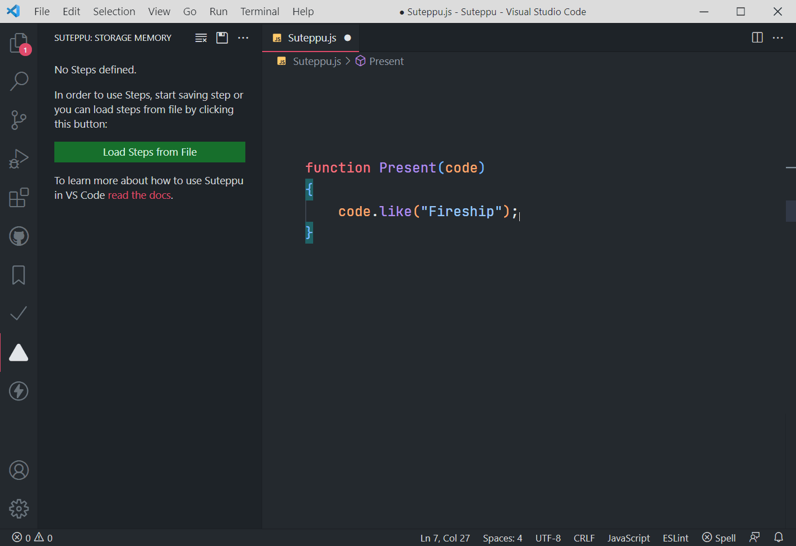
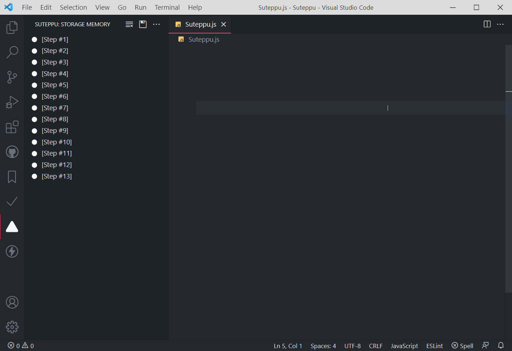

    

# Suteppu

Step by step copy paste for presenting code with [Fireship](https://www.youtube.com/c/Fireship) style.

I made this extension as a fun project and was intended to use it as a way to teach without ever having to type any code.. and yea I know, I know... you can do all of this by just removing and stepping back using the built-in undo system from vscode. But with this extension, you can save your steps into a file for use later on in the future.

Welp.. it's still kinda a useless extension tbh.

# Features

## Save step

## Present code

# Install

You can install this extension directly from [Visual Studio Code Marketplace](https://marketplace.visualstudio.com/), or by running this command inside Visual Studio Code

` ext install itsakaseru.suteppu `

# Usage

This extension will replace the current keyboard shortcut:

1. `Home` : Save current selection to suteppu storage memory.
2. `End` : Redo from the first step in suteppu storage memory.

# License

Copyright (c) Itsakaseru. All rights reserved.

Licensed under the [MIT](https://github.com/Itsakaseru/Suteppu/blob/main/LICENSE) License.