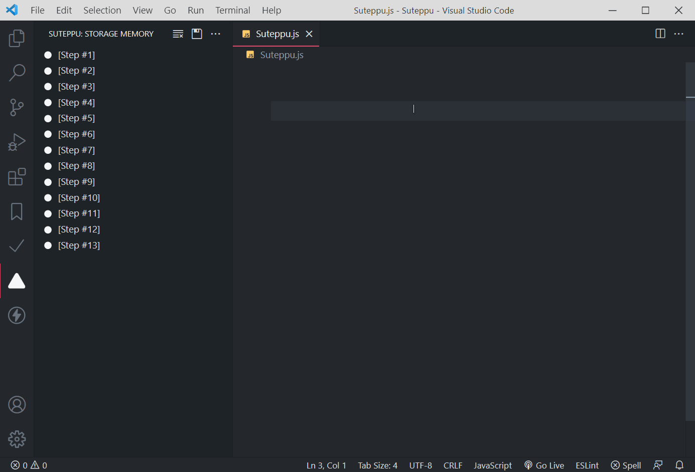

    

# Suteppu

Step by step copy paste for presenting code with [Fireship](https://www.youtube.com/c/Fireship) style.

# Features

# Install

(Coming Soon)
You can install this extension directly from [Visual Studio Code Marketplace](https://marketplace.visualstudio.com/), or by running this command inside Visual Studio Code

` ext install itsakaseru.suteppu `

# Extension Settings

Include if your extension adds any VS Code settings through the `contributes.configuration` extension point.

For example:

This extension contributes the following settings:

* `myExtension.enable`: enable/disable this extension
* `myExtension.thing`: set to `blah` to do something

# Known Issues

Calling out known issues can help limit users opening duplicate issues against your extension.

# Contributions

This extension is still under **closed** development.

# License

Copyright (c) Itsakaseru. All rights reserved.

Licensed under the [MIT](https://github.com/Itsakaseru/Suteppu/blob/main/LICENSE) License.